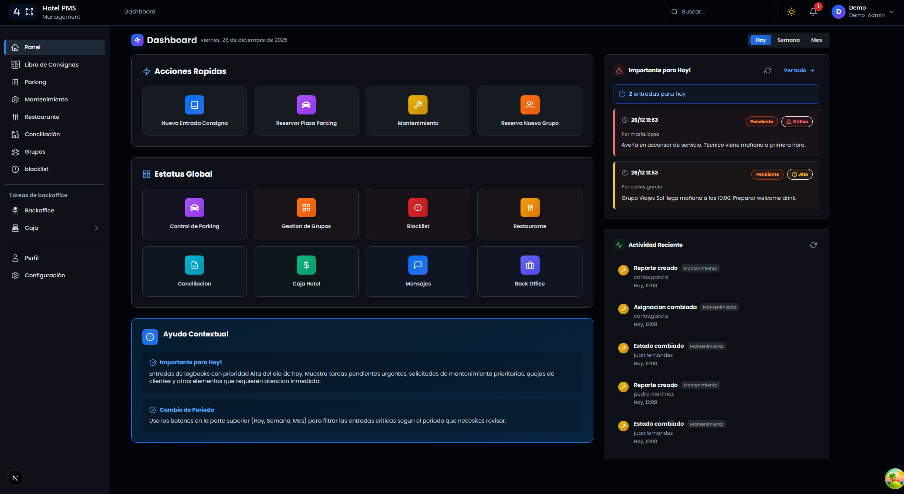
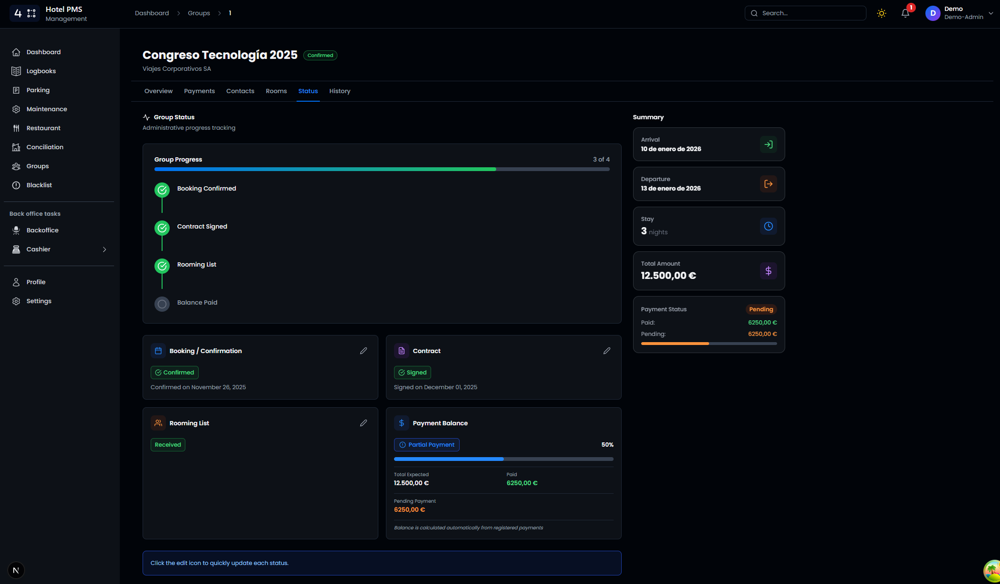
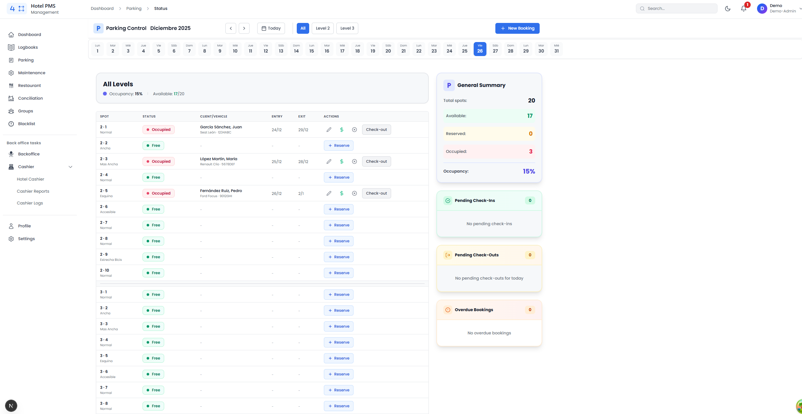
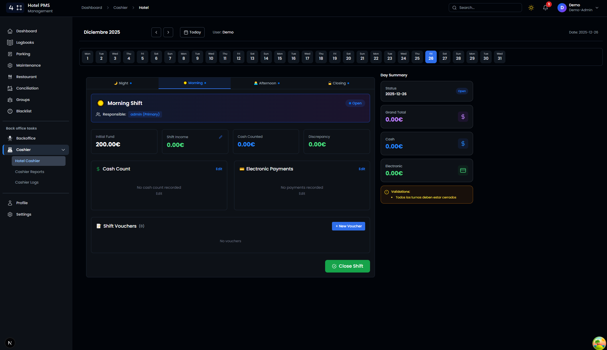
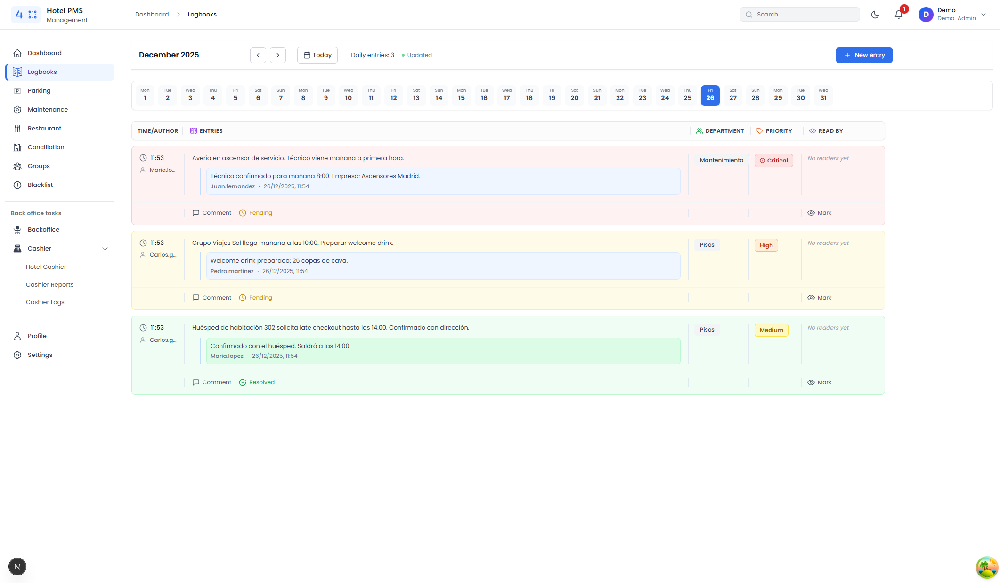
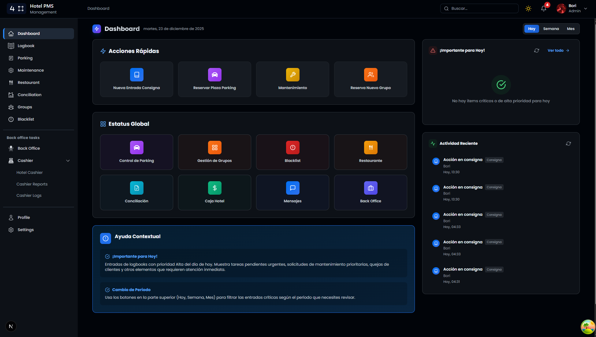
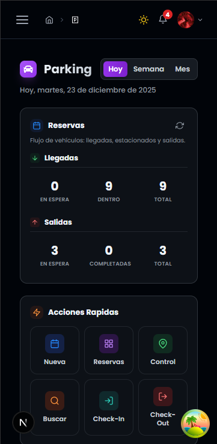

# Four Points - Hotel PMS

Sistema de gestión hotelera (Property Management System) que unifica toda la operativa diaria de un hotel en una sola plataforma: desde el control de caja y logbooks de turno hasta la gestión de grupos, parking, mantenimiento y backoffice.

**Demo en vivo:** [stackbp.es](https://four-points.stackbp.es)

```
Usuario: demo
Contraseña: demo987654
```

> El usuario demo tiene acceso de lectura a todos los módulos. Las operaciones de escritura están restringidas salvo en parking, comentarios de logbook y reportes de mantenimiento.

---

## Módulos

### Logbooks

Registro operativo por turnos. Cada entrada tiene prioridad (baja, media, alta, crítica), departamento y seguimiento de lectura por parte del equipo. Permite comentarios y marca qué miembros del staff han leído cada nota.

### Parking

Gestión completa del aparcamiento: mapa de plazas en tiempo real con estados (libre, ocupado, reservado, vencido), check-in/check-out de vehículos, reservas con flujo paso a paso y control de niveles.

### Caja (Cashier)

Control de caja diario dividido en 4 turnos (noche, mañana, tarde, cierre). Cada turno permite arqueo de efectivo por denominación, registro de pagos electrónicos, creación y justificación de vales. Incluye cierre diario con conciliación, histórico de acciones con filtros, y reportes mensuales exportables a Excel y PDF.

### Grupos

Gestión de reservas grupales con seguimiento completo: datos del grupo, contactos, asignación de habitaciones, control de pagos (parciales y totales) y flujo de estados (pendiente, confirmado, en curso, completado, cancelado). Historial de cambios con auditoría.

### Mantenimiento

Sistema de órdenes de trabajo con prioridad, categoría, ubicación y asignación a personal. Permite adjuntar fotos del desperfecto y seguir el ciclo de vida: abierto, en progreso, completado. Historial completo de cambios por incidencia.

### Conciliación

Cruce diario entre recepción y housekeeping: cada departamento reporta su conteo de habitaciones y el sistema destaca las discrepancias visualmente. Permite notas por habitación y cierre con supervisión.

### Backoffice

Gestión de facturas (pendientes y pagadas), proveedores y categorías. Visor y editor de PDF integrado para sellado y firma de documentos. Estadísticas de gastos y exportación a Excel/PDF.

### Blacklist

Registro de personas con incidencias: datos de identificación, nivel de gravedad, descripción del incidente y documentación adjunta. Búsqueda por nombre o documento.

### Mensajería

Sistema de mensajería interna entre el personal del hotel con conversaciones directas y grupales.

### Notificaciones

Centro de alertas del sistema: asignaciones de mantenimiento, pagos pendientes de grupos, parking vencido y actividad relevante de cada módulo.

### Scheduling

Generación automática de cuadrantes mensuales de turnos. El sistema asigna turnos de mañana (M), tarde (T), noche (N) y soporte interno (PI) respetando restricciones: cobertura mínima/máxima por turno, descanso consecutivo entre jornadas, máximo de días seguidos trabajados, bloques de noches y días libres mensuales. Incluye optimización opcional con IA y puntuación de calidad del cuadrante generado. Vista de rejilla mensual interactiva, panel de estadísticas y exportación a PDF.

### Restaurante

Gestión del inventario de productos con control de stock y alertas de nivel bajo. Seguimiento de pedidos a proveedores con estados de tramitación. Panel de estadísticas con evolución mensual de gastos y tendencias de consumo.

### Perfil y Administración

Gestión de usuarios, roles y departamentos. Panel de auditoría con registro de actividad del sistema (solo administradores).

---

## Preview



<details>
<summary>More Screenshots</summary>

| Groups Module                                    | Parking Status                               |
| ------------------------------------------------ | -------------------------------------------- |
|  |  |

| Cashier Shifts                               | Logbooks                                       |
| -------------------------------------------- | ---------------------------------------------- |
|  |  |

| Desktop View                                 | Mobile View                                |
| -------------------------------------------- | ------------------------------------------ |
|  |  |

</details>

## Características generales

- **Tema claro/oscuro** con detección automática de preferencia del sistema
- **Bilingüe** (Español / English)
- **Exportación** de datos a Excel y PDF en los módulos que lo requieren
- **Responsive** para escritorio, tablet y móvil
- **Control de acceso** por roles (administrador, recepcionista, mantenimiento, etc.)

---

## Stack

| Capa            | Tecnologías                                                |
| --------------- | ---------------------------------------------------------- |
| Frontend        | Next.js, React, TypeScript, Tailwind CSS                   |
| Backend         | Express, TypeScript, MySQL                                 |
| Infraestructura | Vercel (frontend), Render (backend), Aiven (base de datos) |

---

## Aviso legal

Este repositorio contiene **únicamente una muestra pública del código frontend** del sistema Four Points PMS. La totalidad del código fuente — incluyendo el backend, la lógica de negocio, los modelos de datos y la infraestructura — es **software propietario y confidencial**.

**Todos los derechos reservados. Queda expresamente prohibido:**

- Copiar, reproducir o distribuir cualquier parte de este código, total o parcialmente.
- Modificar, adaptar o crear obras derivadas basadas en este software.
- Usar este código, en todo o en parte, con fines comerciales o no comerciales sin autorización expresa y por escrito del autor.
- Publicar, sublicenciar o transferir el código a terceros bajo ningún concepto.

Este repositorio se publica exclusivamente con fines de **demostración y consulta**. La visualización de este código no otorga ningún derecho de uso, licencia implícita ni permiso de ningún tipo.

El incumplimiento de estas condiciones podrá dar lugar a acciones legales conforme a la legislación aplicable en materia de propiedad intelectual.

&copy; 2026 Four Points PMS. Todos los derechos reservados.
